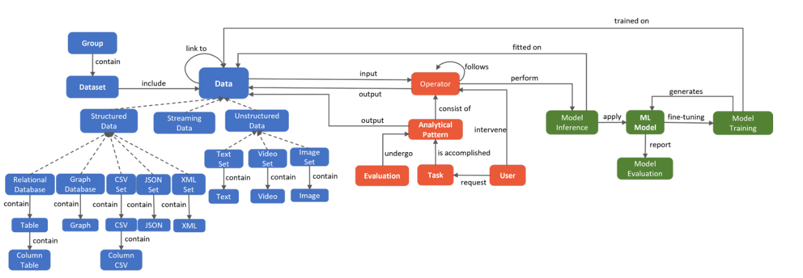

# Analytical Pattern Management API

[](https://img.shields.io/github/commit-activity/m/datagems-eosc/ap-management)
[](https://img.shields.io/github/license/datagems-eosc/ap-management)

This is the documentation site for the Analytical Pattern Management service. The service provides a RESTful API for managing Analytical Patterns in a Neo4j graph database.

## What are Analytical Patterns?

An **Analytical Pattern** (AP) is a graph-based representation of a sequence of data transformations. An AP is composed of **Operators**, which can take one or several inputs to produce an output.

Analytical Patterns are used to understand, document, and analyze complex data workflows and data provenance.



## Key Features

| Feature | Description |
|---------|-------------|
| CRUD | Create, retrieve, and list Analytical Patterns via REST |
| Schema validation | Validate a PG-JSON graph against a JSON Schema before storing |
| Semantic search | Search APs by natural language query using vector similarity (requires Neo4j 5.11+) |

## Quick Links

- [API](openapi.md) - OpenAPI specification
- [Configuration](configuration.md) - How to configure the service
- [Deployment](deployment.md) - Deployment guides for various environments
- [Architecture](architecture.md) - Technical architecture details

## Getting Started

The best solution is to use the provided .devcontainer file. The neo4j database will already be configured.

To run it locally without the devcontainer:

```bash
# Requirements python >=3.13, uv, neo4j instance running
uv sync --all-groups
cp .env.example .env
# (Fill all the required variable in .env)
uv run ap_management/main.py

```

The API will be available at `http://localhost:5000/api/v1`

### Interactive Documentation

- **Swagger UI**: http://localhost:5000/docs
- **ReDoc**: http://localhost:5000/redoc
